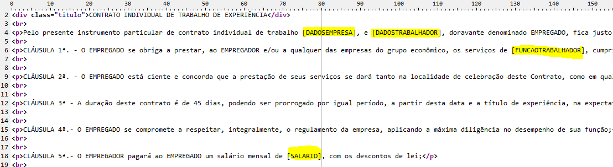
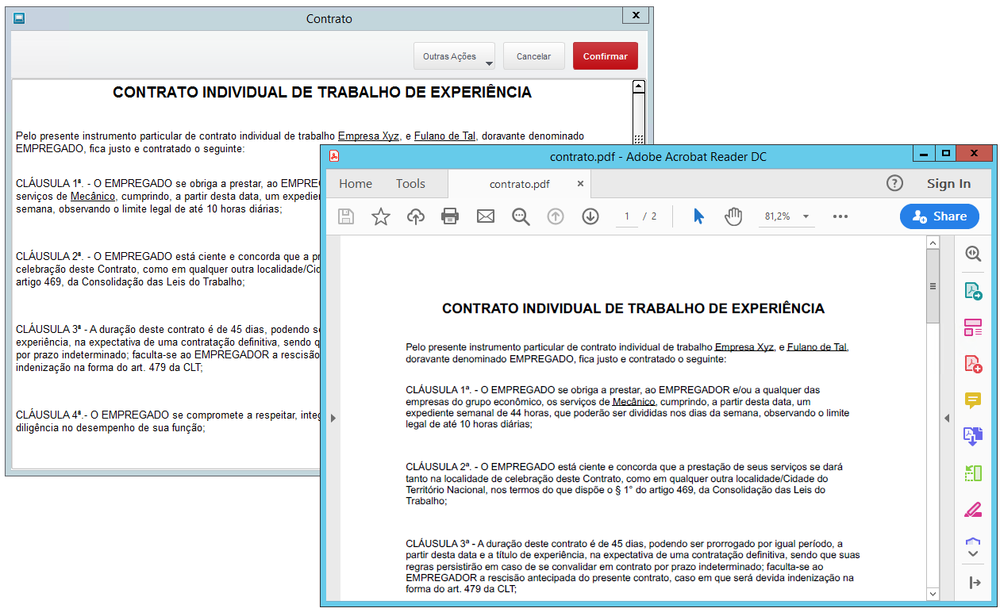

## tSimpleEditor
Exporte um arquivo HTML para PDF usando tSimpleEditor

Primeiro, criei o seu arquivo HTML, e dentro do arquivo, inclua algumas variáveis, no meu exemplo as variáveis estarão entre colchetes [].

Dentro do fonte, use o comando REPLACE() para substituir o conteúdo das variaveis.

Para ler o arquivo html, use a função MEMOREAD e com o componente tSimpleEditor você pode visualizar o HTML e exportar para PDF, o seu uso é bem simples.

